## `$ whoami`

```bash
$ cat about.txt

  Name      : Seungyong Cho
  Education  : KDMHS 19HD · SKKU CSE
  Working on : skkuverse
  Learning   : TypeScript · Swift
  Status     : Always learning, always shipping 🚀
```

<br/>

## `$ ls skills/`

### 🌐 Frontend · Web
<div>
  
  
</div>

### 📱 Frontend · App
<div>
  
  
</div>

### 🧩 Backend
<div>
  
  
</div>

### 🛠️ DevOps & Tools
<div>
  
  
  
  
</div>

### 💬 Languages
<div>
  
  
</div>

<br/>

## `$ git stats`

<div align="center">
  
</div>
